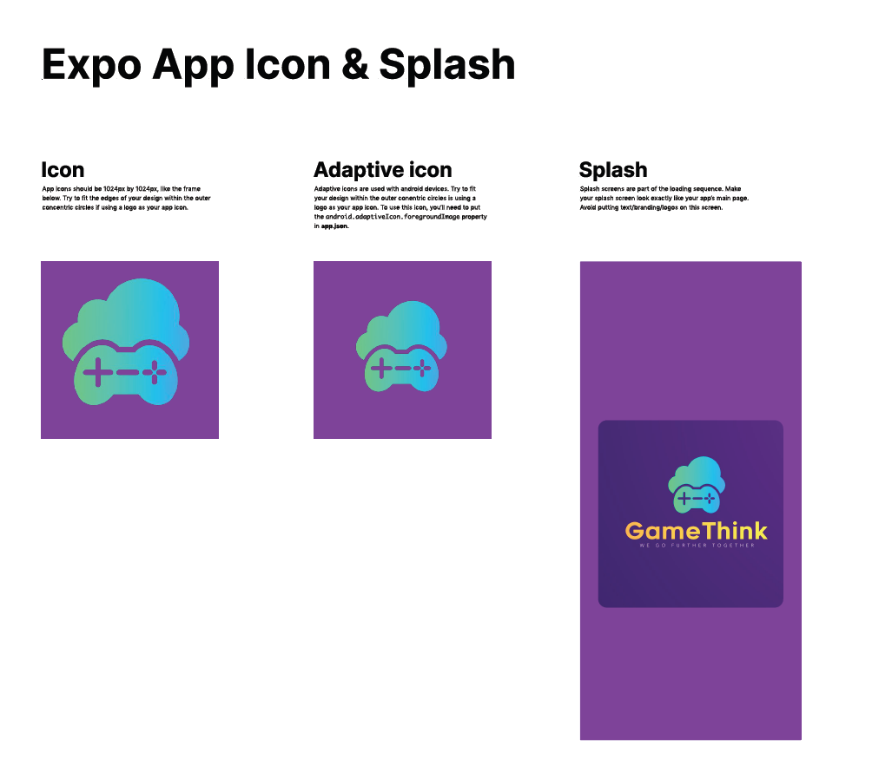
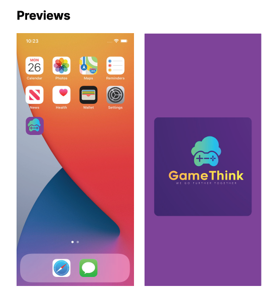

# GameThink 🎮

GameThink is a React Native mobile app (built with Expo) where users can discover, browse and share their favorite games.

I designed and developed the entire **UI interface**, **logo**, and all screens in the app.

## Features ✨

- 🎬 **Custom Splash Screen** with animation
- 🏠 **FeedScreen** with posts from users
- 🎮 **Game Catalog Page** — loads game data from an external API
- 👤 **User Account Page**
- 📝 **User Posts Page** where users can view and create posts

---

### General view:

- Figma :
  

  

---

## Technical Highlights ⚙️

- 📡 Data fetching implemented using `useEffect` — external API used to load game data
- 💅 Custom UI fully designed with **Flexbox** for responsive layouts
- ⚛️ Uses 10+ Core Components and APIs, including:

  - `View`, `Text`, `Image`, `ScrollView`, `FlatList`, `TouchableOpacity`, `SafeAreaView`, `TextInput`, `Button`, `Modal`, and more
  - Includes platform-specific components for iOS/Android

- 📱 Uses **React Navigation** for routing across screens
- 🛠️ ESLint configuration included for code quality
- 🎨 Prettier used to auto-format the entire codebase

---

## Third-party Libraries 📚

The project uses the following React Native third-party libraries:

1. **React Navigation** (navigation between screens)
2. **Lottie React Native** (animated splash screen)
3. **Axios** (fetching data from external API)

---

### 🛠️ Technologies Used

- **React Native** — core framework for building native apps
- **Expo** — framework and platform for universal React apps
- **React Navigation** — routing and navigation
- **Axios** — HTTP client for API requests
- **Lottie React Native** — animations (splash screen and other UI effects)
- **React Native Core Components & APIs** — used extensively across the app (View, Text, FlatList, Image, ScrollView, SafeAreaView, TextInput, Modal, etc.)
- **ESLint** — code linting and quality assurance
- **Prettier** — consistent code formatting
- **Flexbox** — layout and responsive design

---

## Summary 📝

This project was developed as part of **Laboration 2: React Native**
It fulfills all requirements for **VG level**:

✅ Custom splash screen
✅ At least three third-party libraries
✅ Use of 10+ Core Components & APIs + platform-specific component
✅ React Navigation implemented
✅ ESLint and Prettier configuration included
✅ Project designed and implemented from scratch with original UI & branding
